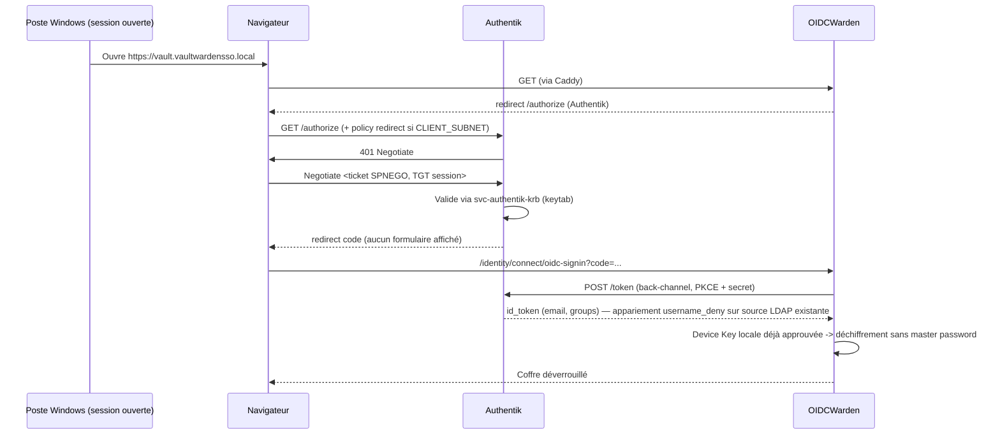
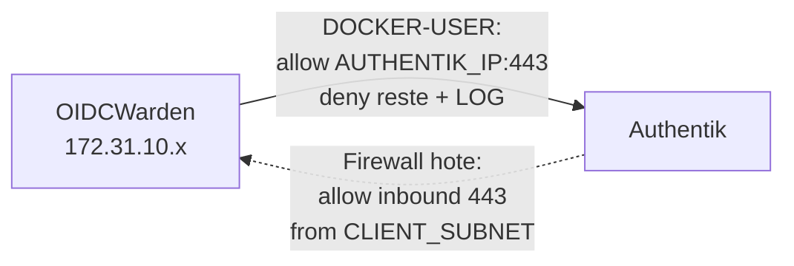

# Architecture — SSO Kerberos passwordless (Vaultwarden/OIDCWarden ↔ Authentik ↔ AD)

## Vue d'ensemble des flux

```mermaid
flowchart LR
    subgraph Client["Poste client du domaine (CLIENT_SUBNET)"]
        BR[Navigateur — TGT de session Windows]
    end

    subgraph DC["DC — 192.168.100.76"]
        AD["AD DS + DNS"]
        CA["AD CS (racine)"]
        KRB["svc-authentik-krb\n(SPN HTTP/auth.*)"]
    end

    subgraph AUTH["Authentik — auth.vaultwardensso.local"]
        SRC["Source Kerberos\n(SPNEGO)"]
        FLOW["Flow identification\n+ policy redirect intranet"]
    end

    subgraph DockerHost["Hôte Docker — 192.168.100.89"]
        subgraph FE["réseau frontend"]
            CADDY["Caddy 443/80"]
        end
        subgraph BE["réseau backend (internal)"]
            VW["OIDCWarden :80"]
        end
        subgraph EG["réseau authentik_egress (/29, filtré)"]
            VWE(("egress OIDCWarden"))
        end
        CADDY --- VW
        VW --- VWE
    end

    BR -- "1. HTTPS vault" --> CADDY
    BR -- "2. front-channel: negotiate SPNEGO" --> AUTH
    AUTH -. "valide le ticket via" .-> KRB
    VWE -- "3. back-channel: discovery/token/jwks (443)" --> AUTH

    style BE fill:#1f2937,stroke:#10b981
    style EG fill:#1f2937,stroke:#f59e0b
    style DC fill:#3f1d1d,stroke:#ef4444
    style AUTH fill:#1e293b,stroke:#3b82f6
```

## Séquence d'authentification passwordless (device déjà onboardé)

## Deux plans réseau (à ne jamais confondre)

| Plan | Acteur → cible | Contenu | Contrôle réseau |
|---|---|---|---|
| **Front-channel navigateur** | Navigateur → Authentik:443 | Negotiate SPNEGO, puis `/authorize` | Firewall Authentik inbound scopé `CLIENT_SUBNET` (hors périmètre Docker, à durcir côté hôte Authentik) |
| **Back-channel conteneur** | OIDCWarden → Authentik:443 | discovery, token, jwks | `authentik_egress` + `DOCKER-USER` (seule destination : `AUTHENTIK_IP:443`) |

## Filtrage symétrique (défense en profondeur)

- **Egress conteneur** : default-deny, seul `AUTHENTIK_IP:443` autorisé, tout le reste `LOG`+`DROP` (compteur `VW-EGRESS-DROP` = 0 en nominal ; ≠0 = anomalie SIEM).
- **SPNEGO** exposé uniquement sur le périmètre intranet : la policy Authentik ne tente le SPNEGO que pour les clients du `CLIENT_SUBNET` (cf. `deploy/authentik/kerberos-sso-blueprint.yaml`), hors subnet = fallback formulaire.

## Points critiques hérités de l'itération AD FS (toujours valables)

- Résolution DNS du conteneur vers l'IdP : dépendance critique, éviter tout fallback DNS public (fuite OPSEC des noms internes). Voir `docker-compose.yml` (`extra_hosts` commenté, à activer seulement si le symptôme réapparaît).
- `internal: true` bloque tout egress (WAN **et** LAN) : d'où le réseau `authentik_egress` dédié et filtré, plutôt qu'un assouplissement du réseau `backend`.
- TLS conteneur → IdP : ne jamais utiliser `--insecure`/`-k` ; faire confiance à *sa* CA (image dérivée), jamais désactiver la vérification.
- Casse de l'issuer OIDC : toujours copier `SSO_AUTHORITY` verbatim depuis `/.well-known/openid-configuration`, jamais le retaper.

Voir `legacy/docs/00_RETROSPECTIVE_embuches.md` pour le détail complet de ces pièges (contexte AD FS, mais les causes racines réseau/TLS/PowerShell restent pertinentes).
