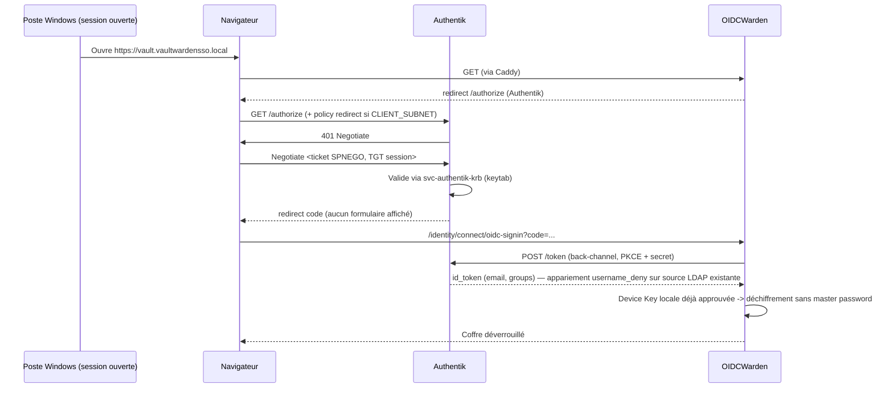

# Architecture — SSO Kerberos passwordless (Vaultwarden/OIDCWarden ↔ Authentik ↔ AD)

## Vue d'ensemble des flux

```mermaid
flowchart LR
    subgraph Client["Poste client du domaine (CLIENT_SUBNET)"]
        BR[Navigateur — TGT de session Windows]
    end

    subgraph DC["DC — 192.168.100.76"]
        AD["AD DS + DNS"]
        CA["AD CS (racine)"]
        KRB["svc-authentik-krb\n(SPN HTTP/auth.*)"]
    end

    subgraph DockerHost["Hôte Docker — 192.168.100.89 (Authentik = même VM, même docker-compose)"]
        subgraph FE["réseau frontend"]
            CADDY["Caddy 443/80\n(vault.* + auth.*, seul point TLS)"]
        end
        subgraph BE["réseau backend (internal)"]
            VW["OIDCWarden :80"]
        end
        subgraph APX["réseau authentik_proxy (internal)"]
            AKS["authentik-server :9000"]
        end
        subgraph AIN["réseau authentik_internal (internal)"]
            AKW["authentik-worker"]
            PG[("postgresql")]
            RD[("redis")]
        end
        CADDY --- VW
        CADDY --- AKS
        AKS --- PG
        AKS --- RD
        AKW --- PG
        AKW --- RD
    end

    BR -- "1. HTTPS vault" --> CADDY
    BR -- "2. front-channel: negotiate SPNEGO (via Caddy)" --> CADDY
    AKS -. "valide le ticket via" .-> KRB
    VW -- "3. back-channel: discovery/token/jwks (via Caddy, réseau Docker interne)" --> CADDY

    style BE fill:#1f2937,stroke:#10b981
    style APX fill:#1f2937,stroke:#3b82f6
    style AIN fill:#1f2937,stroke:#6366f1
    style DC fill:#3f1d1d,stroke:#ef4444
```

## Séquence d'authentification passwordless (device déjà onboardé)

## Deux plans réseau (à ne jamais confondre)

Authentik tournant désormais sur la même VM que Vaultwarden/Caddy (même `docker-compose.yml`), les deux plans traversent le même point unique de terminaison TLS — Caddy — au lieu de deux chemins réseau distincts (LAN vs egress filtré) comme dans l'itération précédente.

| Plan | Acteur → cible | Contenu | Contrôle réseau |
|---|---|---|---|
| **Front-channel navigateur** | Navigateur → Caddy (`auth.*`) → `authentik-server` | Negotiate SPNEGO, puis `/authorize` | Caddy termine le TLS ; `authentik-server` n'est joignable que via le réseau Docker `authentik_proxy` (`internal: true`), aucun port publié directement |
| **Back-channel conteneur** | OIDCWarden → Caddy (`auth.*`) → `authentik-server` | discovery, token, jwks | Même chemin que le front-channel : réseau `backend` (OIDCWarden↔Caddy) puis `authentik_proxy` (Caddy↔authentik-server), tous deux `internal: true` — aucune IP/URL LAN à connaître ni à filtrer |

## Isolation réseau Docker (défense en profondeur)

- **`backend`** (`internal: true`) : OIDCWarden ↔ Caddy uniquement. Aucun egress WAN/LAN possible depuis le conteneur Vaultwarden.
- **`authentik_proxy`** (`internal: true`) : Caddy ↔ `authentik-server` uniquement. `authentik-server` n'a pas d'accès réseau au-delà de ce réseau et de `authentik_internal`.
- **`authentik_internal`** (`internal: true`) : `authentik-server`/`authentik-worker` ↔ `postgresql`/`redis` uniquement. Base de données et cache ne sont joignables depuis aucun autre réseau.
- **`frontend`** : seul réseau non-`internal`, exposant uniquement Caddy (443/80) vers l'extérieur du host Docker.
- Vérification périodique recommandée (cf. `docs/03_supervision_siem.md`) : `docker network inspect <nom> | grep Internal` doit rester `true` sur les trois réseaux internes — une dérive réintroduirait un chemin d'egress WAN/LAN non maîtrisé.
- **SPNEGO** exposé uniquement sur le périmètre intranet : la policy Authentik ne tente le SPNEGO que pour les clients du `CLIENT_SUBNET` (cf. `deploy/authentik/kerberos-sso-blueprint.yaml`), hors subnet = fallback formulaire. Ce filtrage reste applicatif (policy Authentik), pas réseau, puisque Authentik n'est plus atteint par un chemin LAN dédié.

## Points critiques hérités de l'itération AD FS (toujours valables)

- Résolution des noms de service entre conteneurs : désormais assurée nativement par le DNS interne Docker (alias de réseau `authentik-server`, `postgresql`, `redis`, `vaultwarden`) — plus de dépendance à un `extra_hosts`/IP LAN codé en dur, donc plus de risque de fuite OPSEC des noms internes vers un DNS public.
- `internal: true` bloque tout egress (WAN **et** LAN) sur `backend`/`authentik_proxy`/`authentik_internal` : c'est la propriété structurelle qui remplace l'ancien réseau `authentik_egress` filtré par iptables — plus simple et plus robuste (rien à maintenir côté firewall hôte).
- TLS conteneur → IdP : ne jamais utiliser `--insecure`/`-k` ; faire confiance à *sa* CA (image dérivée), jamais désactiver la vérification.
- Casse de l'issuer OIDC : toujours copier `SSO_AUTHORITY` verbatim depuis `/.well-known/openid-configuration`, jamais le retaper.

Voir `legacy/docs/00_RETROSPECTIVE_embuches.md` pour le détail complet de ces pièges (contexte AD FS, mais les causes racines réseau/TLS/PowerShell restent pertinentes).
