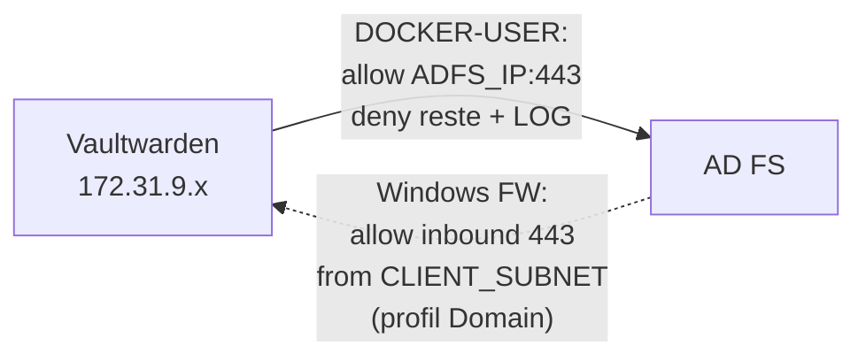
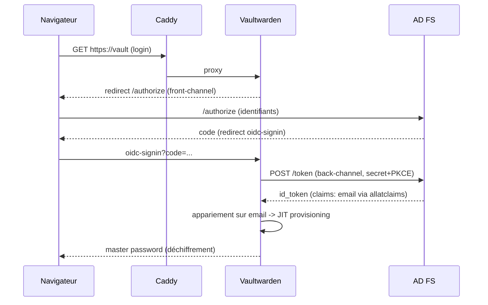

# Architecture — flux OIDC & segmentation réseau

## Vue d'ensemble des flux

```mermaid
flowchart LR
    subgraph Client["Poste client (CLIENT_SUBNET)"]
        BR[Navigateur]
    end

    subgraph DMZ["Zone tier-0 (lab : colocalisé)"]
        ADFS["AD FS / OIDC\nSRVADTEST:443"]
        DC["AD DS + DNS"]
        CA["AD CS (racine)"]
        ADFS --- DC
        ADFS --- CA
    end

    subgraph DockerHost["Hôte Docker (VWHOST)"]
        subgraph FE["réseau frontend"]
            CADDY["Caddy\n443/80"]
        end
        subgraph BE["réseau backend (internal)"]
            VW["Vaultwarden\n:80"]
        end
        subgraph EG["réseau adfs_egress (/29, filtré)"]
            VWE(("egress\nVW"))
        end
        CADDY --- VW
        VW --- VWE
    end

    BR -- "1. HTTPS vault" --> CADDY
    BR -- "2. front-channel: /authorize (redirect)" --> ADFS
    VWE -- "3. back-channel: discovery/token/jwks (443)" --> ADFS

    style BE fill:#1f2937,stroke:#10b981
    style EG fill:#1f2937,stroke:#f59e0b
    style DMZ fill:#3f1d1d,stroke:#ef4444
```

## Deux plans réseau (à ne jamais confondre)

| Plan | Acteur → cible | Contenu | Contrôle réseau |
|---|---|---|---|
| **Front-channel** | Navigateur → AD FS:443 | `/authorize` (saisie identifiants) | firewall AD FS inbound scopé `CLIENT_SUBNET` |
| **Back-channel** | Conteneur → AD FS:443 | discovery, token, jwks | `adfs_egress` + `DOCKER-USER` (seul `ADFS_IP:443`) |

## Filtrage symétrique (défense en profondeur)

- **Egress conteneur** : default-deny, seul `ADFS_IP:443` autorisé, tout le reste `LOG`+`DROP` (compteur `VW-EGRESS-DROP` = 0 en nominal ; ≠0 = anomalie SIEM).
- **Ingress AD FS** : allow 443 uniquement depuis `CLIENT_SUBNET`, profil `Domain` (fail-safe hors domaine), `LogBlocked` actif.

## Séquence d'authentification (chronologie)

## Point critique AD FS 2016+

Le claim `email` (custom) n'est placé dans l'`id_token` **que si le scope `allatclaims` est accordé** au client. Sans lui : `Neither id token nor userinfo contained an email`. C'était le blocage final.

`allatclaims` place **tous** les claims des transform rules dans l'id_token → **restreindre les règles au strict minimum** (email seul) pour éviter la surexposition d'attributs (minimisation RGPD). Contrôle continu via l'audit event 501.
